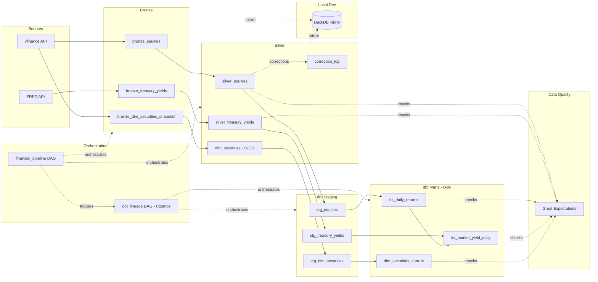
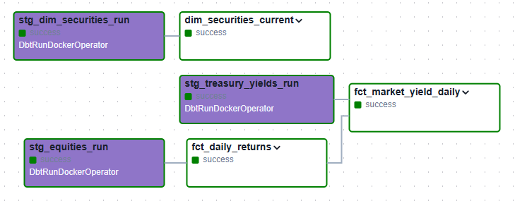
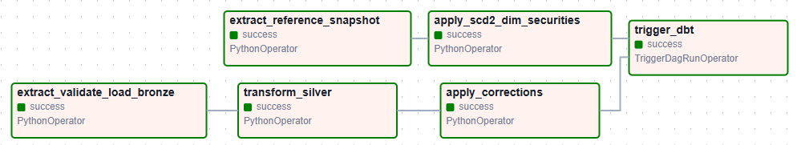
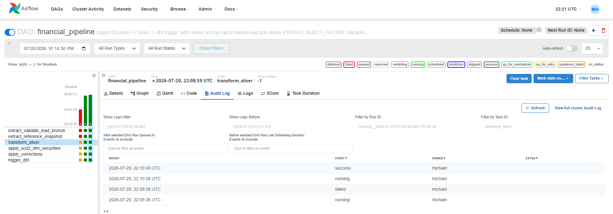
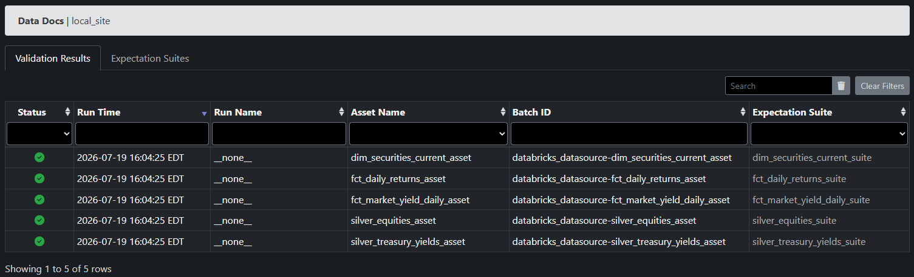
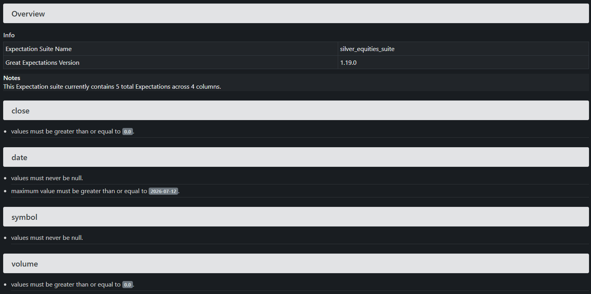

# Financial Market Data Pipeline

> ## Business Problem
>
> Institutional investors and quantitative analysts need reliable historical
> market data to support backtesting, factor modeling, and portfolio analytics.
> This pipeline ingests market data from heterogeneous sources, validates data
> quality, models historical dimensions, and publishes analytics-ready datasets
> — emphasizing reliability, reproducibility, and maintainability over raw
> feature count.

## Architecture

Two source lineages run independently through Bronze and Silver — yfinance
feeds both `bronze_equities` and, separately, the SCD2 dimension snapshot
(`bronze_dim_securities_snapshot`); FRED feeds `bronze_treasury_yields` on
its own path. Neither branch depends on the other until both are staged by
dbt and joined at the Gold layer — `fct_market_yield_daily` is a LEFT JOIN
of `fct_daily_returns` against the staged treasury yields, the one place
the two lineages actually meet before Gold. Bronze and Silver are
current-state layers, not historical archives — both use a full-replace
load strategy, with `dim_securities` and correction-handling as the two
deliberate exceptions. Full reasoning for every load-strategy choice is in
`docs/data_modeling_decisions.md`; a full walkthrough of this diagram is
in `docs/architecture.md`.

## Tech Stack

| Tool                             | Purpose                                               |
| -------------------------------- | ----------------------------------------------------- |
| Databricks (PySpark, Delta Lake) | Bronze/Silver/Gold medallion ingestion                |
| dbt-core                         | Staging + Gold marts, tests, docs                     |
| DuckDB                           | Local dev-loop validation                             |
| Great Expectations               | Data quality checks                                   |
| Airflow                          | Orchestration (retries, logging)                      |
| Astronomer Cosmos                | dbt orchestration — auto-generated per-model task DAG |
| Terraform                        | IaC — Unity Catalog schema + grants                   |
| GitHub Actions                   | CI/CD — dbt tests, SQL lint                           |

**Certificates:**

## Pipeline Flow

Two Airflow DAGs orchestrate the pipeline end to end, running in a local
Docker Compose stack (Postgres, scheduler, webserver).

`financial_pipeline` runs two branches in parallel, converging before the
dbt trigger:

- **Market data branch:** `extract_validate_load_bronze` (pulls yfinance
  equities and FRED treasury yields, schema-validates each record against
  `config/schemas/` — malformed records flagged, not silently dropped,
  writes to Bronze Delta tables) → `transform_silver` (type casting,
  deduplication, standardization) → `apply_corrections` (detects and
  MERGEs late-arriving/revised records into `silver_equities` via a
  30-day trailing-window diff, logging every changed field to
  `correction_log`).
- **Reference data branch:** `extract_reference_snapshot` (pulls a fresh
  security reference-data snapshot) → `apply_scd2_dim_securities`
  (versions `dim_securities`: new rows appended, expired rows closed with
  an `end_date`).

Both branches feed into `trigger_dbt`, which waits for both to complete
before handing off to the second DAG.

`dbt_lineage`, a Cosmos-generated `DbtDag`, then runs one Airflow task per
dbt model — staging (`stg_equities`, `stg_treasury_yields`,
`stg_dim_securities`) and marts (`fct_daily_returns`,
`fct_market_yield_daily`, `dim_securities_current`) — each executing in an
isolated Docker container.

`financial_pipeline` also demonstrates retry-based recovery via an opt-in
Airflow Variable (`PHASE8_INJECT_FAILURE`) that deliberately fails
`transform_silver` on its first attempt, then succeeds on retry:

**Local development:** Bronze/Silver/Dimension/Audit tables are mirrored
into a local DuckDB file (`src/mirror_to_duckdb.py`) for dev-loop
validation, avoiding serverless compute costs on every ad hoc query during
active development. Read-only mirror — no writes ever flow back to Delta.

Full rationale — execution mode, manifest-based task loading, runtime
credential handling, headless container auth — in
`docs/data_modeling_decisions.md`.

## Data Model

Four data layers: **Bronze** (raw, schema-validated on ingest), **Silver**
(cleaned and conformed, with `dim_securities` as a Type 2 slowly changing
dimension), **Gold** (dbt staging + marts), and an **audit layer**
(`correction_log`, tracking every field-level correction applied to
`silver_equities`). Bronze, Silver, and the dimension/audit tables are
additionally mirrored into a local DuckDB file for dev-loop validation —
same schema, same grain, refreshed on demand, never a second source of
truth.

Full grain, keys, and column-level definitions for every table are in
`docs/data_dictionary.md`.

## Data Modeling Decisions

**Delta Lake vs. Parquet.** ACID transactions, schema evolution, and
native MERGE support were required for reliable late-arriving corrections
and SCD2 versioning — a plain Parquet layer would have needed all three
built by hand. Full context, decision, and consequences in
[`docs/adr/0001-delta-lake-vs-parquet.md`](docs/adr/0001-delta-lake-vs-parquet.md).

**Partitioning over ZORDER/Liquid Clustering.** `year_month` partitioning
was adopted as the storage strategy after benchmarking showed ZORDER and
Liquid Clustering produce no measurable benefit at this data volume —
both need multiple files per partition to have anything to skip, and
Delta's compaction collapses this dataset to one. Full benchmark results
in the Performance section below.

**Full-replace load strategy (Bronze/Silver).** Both source APIs
retroactively revise historical values — yfinance adjusts entire
historical series on stock splits, FRED republishes revised economic
data — so full-replace guarantees every run reflects a single, internally
consistent upstream state rather than a blend of old and new data with no
way to tell them apart. Delta's transaction log provides a bounded
time-travel safety net as a byproduct, not a substitute for a true audit
trail.

**SCD Type 2 for `dim_securities`.** Preserves a security's
reference-attribute history for point-in-time correctness, using a random
UUID surrogate key and an append/MERGE load pattern — the one deliberate
exception to the full-replace convention above, since SCD2's entire
purpose is accumulating history rather than replacing it.

**Windowed MERGE for late-arriving corrections.** `silver_equities`
corrections are detected via a 30-day trailing-window diff against a fresh
pull, not a full-history recheck — vendor revisions are almost always
recent, and a full-history diff would be wasteful API usage for
negligible additional coverage. Every changed field is logged to
`correction_log` individually for a precise, queryable audit trail.

Full rationale for the strategies above — plus additional infrastructure
and orchestration decisions (Terraform's Unity Catalog scope, Great
Expectations' execution engine, Cosmos's orchestration mode, and others)
not previewed here — is documented in full in
`docs/data_modeling_decisions.md`.

## Testing

Three layers, each covering distinct ground:

- **dbt tests** — 10 passing tests (uniqueness, not-null, referential
  integrity) on the Gold marts, run via `dbt test` on demand against live
  Databricks SQL. CI runs `dbt parse` on every push instead — a
  structural/compile check, not a live test run — to keep every-push CI
  fast and warehouse-independent.
- **pytest** (`tests/`) — `test_transform.py` unit-tests
  `validate.py`'s schema-validation logic directly, since it has no Spark
  dependency; `transform.py`'s own functions aren't unit tested locally,
  since this project's Spark access (`databricks-connect`) only supports
  remote sessions with no offline session to build a test DataFrame
  against — documented as a deliberate, scoped limitation in
  `docs/data_modeling_decisions.md`, not an oversight. `verify.py` and
  `verify_duckdb_mirror.py` run real-data checks against actual pipeline
  output (including an automated SCD2 regression check —
  `verify_dim_securities`) and confirm row-count parity between the
  DuckDB mirror and source Delta tables, respectively. These run on
  demand against live data, not in CI.
- **Great Expectations** — five suites (`silver_equities`,
`silver_treasury_yields`, `fct_daily_returns`, `fct_market_yield_daily`,
`dim_securities_current`) covering freshness and range/set checks that
complement rather than duplicate dbt's coverage. Run on demand against
live Databricks SQL, not in every-push CI.

## Performance

Partition pruning, ZORDER, and Liquid Clustering were benchmarked against a
synthetic dataset sized to exercise Delta Lake's storage-layer optimizations
(real Bronze/Silver tables are dev-scale and too small to demonstrate these
patterns). Partitioning by `year_month` reduced bytes read by 97.9% for a
representative date-range query. ZORDER and Liquid Clustering produced
structural null results at this data volume — investigated and explained
using Delta's own operation metrics rather than left unexplained. A
planned compute-configuration comparison (warehouse size, Photon,
autoscaling) was found not executable on Databricks Free Edition, which
locks to a single 2X-Small warehouse with no exposed controls —
documented as a scoped finding rather than dropped.

Full methodology, results, and screenshots in
`docs/performance_and_scaling.md`.

## Risk Register

| Risk                                                                           | Mitigation                                                                                                                                                                                                                                        |
| ------------------------------------------------------------------------------ | ------------------------------------------------------------------------------------------------------------------------------------------------------------------------------------------------------------------------------------------------- |
| API rate limiting (yfinance, FRED)                                             | Exponential backoff with jitter in `src/extract.py`, distinct handling per source (FRED: retry on HTTP 429/5xx via `with_retry`; yfinance: retry on empty-result or exception via a dedicated check, since it fails silently rather than raising) |
| Schema drift from source APIs                                                  | JSON schema validation on ingest (`config/schemas/`), malformed records flagged not silently dropped                                                                                                                                              |
| Duplicate or corrected records                                                 | Delta MERGE upsert pattern, logged to `correction_log`                                                                                                                                                                                            |
| Failed DAG run                                                                 | Airflow retries, demonstrated via opt-in failure-injection (`PHASE8_INJECT_FAILURE`)                                                                                                                                                              |
| Invalid or out-of-range market data                                            | Great Expectations validation suites                                                                                                                                                                                                              |
| Single compute resource (Free Edition: one 2X-Small warehouse, no autoscaling) | Documented as a scoped limitation in `docs/performance_and_scaling.md`, not worked around — acceptable at this project's scale, called out as a real production gap                                                                               |

## Lessons Learned

- Correctly configured optimizations don't always show measurable benefit
  at small scale — ZORDER and Liquid Clustering both needed multiple files
  per partition to have anything to skip, and this dataset compacted to
  one. Worth documenting as a real finding, not chasing until the numbers
  "look right."
- Not every failure raises an exception. A single retry mechanism built
  around catching exceptions would have silently treated yfinance's empty
  result as success — assuming uniform failure behavior across data
  sources is a real trap.
- Running the full test suite against live infrastructure on every push
  means either writing to the warehouse on every commit or testing
  against data that may not reflect the code being tested — keeping
  `dbt test` and Great Expectations on-demand was a deliberate boundary,
  not an automation gap.
- Full-replace load strategies trade write cost for operational
  simplicity; that trade-off is only correct at the data volumes this
  pipeline currently operates at, and is a known scaling boundary rather
  than a universal choice.

## Future Enhancements

- **Cheaper full-replace via a windowed trigger check** — re-pulling and
  rewriting full history every run gets more expensive as historical
  data grows. For treasury yields, where FRED's corrections are reliably
  window-bound, a recency-window comparison could safely replace
  full-replace with a targeted windowed MERGE — the same pattern already
  used for equities' late-arriving corrections. For equities, a recency
  window could still serve as a cheap trigger to detect that something
  changed, since split adjustments shift recent pre-split prices too —
  but the fix, once triggered, still has to touch full history, since the
  adjustment itself isn't scoped to the window. Not yet designed or
  tested for either source.
- **Scheduled live-warehouse testing with alerting** — a nightly workflow
  running `dbt build` and the full Great Expectations suite against live
  data, with Slack/email notification on failure. The every-push CI tier
  intentionally stays warehouse-independent for speed; this would close
  the gap where a referential-integrity or data-quality regression could
  go undetected until someone runs the tests by hand.
- **Additional asset classes with streaming ingestion** — e.g., crypto
  trade data via exchange WebSocket feeds (Coinbase, Binance), which are
  continuous and always-on rather than daily-batch like the current
  equities/treasury sources — the one asset class where Kafka/streaming
  ingestion would solve a real problem, rather than being added for its
  own sake against data that doesn't need it.
- **Consumption layer** — this project stops at Gold-layer,
  analytics-ready marts. Natural next consumers include a downstream
  BI/dashboard layer (e.g., Power BI or Tableau connecting directly to
  `fct_daily_returns` and `fct_market_yield_daily`) or ML use cases like
  return-direction classification built on the same marts — both out of
  scope for the initial build.
- **AWS/GCP infrastructure** — Databricks Free Edition doesn't expose
  underlying cloud-provider APIs, so native AWS/GCP resources (beyond
  what Unity Catalog already provides) aren't reachable without migrating
  off Free Edition entirely — out of scope for this project as currently
  hosted.
- **Snowflake portability** — porting (not rebuilding) the existing dbt
  project to a second `profiles.yml` target against a Snowflake free
  trial, running the Gold-layer models unchanged to demonstrate the
  transformation layer isn't locked to a single warehouse.

## Progress Tracker

- [x] Phase 0 — Setup & scaffold
- [x] Phase 1 — Databricks & dbt Fundamentals Certificates
- [x] Phase 2 — Bronze ingestion & data contracts
- [x] Phase 3A — Silver: cleaning
- [x] Phase 3B — Silver: historical dimensions & corrections
- [x] Phase 4 — DuckDB local validation
- [x] Phase 5 — dbt + Gold layer
- [x] Phase 6 — Great Expectations
- [x] Phase 7 — Terraform
- [x] Phase 8 — Airflow orchestration
- [x] Phase 9 — CI/CD
- [x] Phase 10 — Performance & scaling documentation
- [x] Phase 11 — Documentation & README
