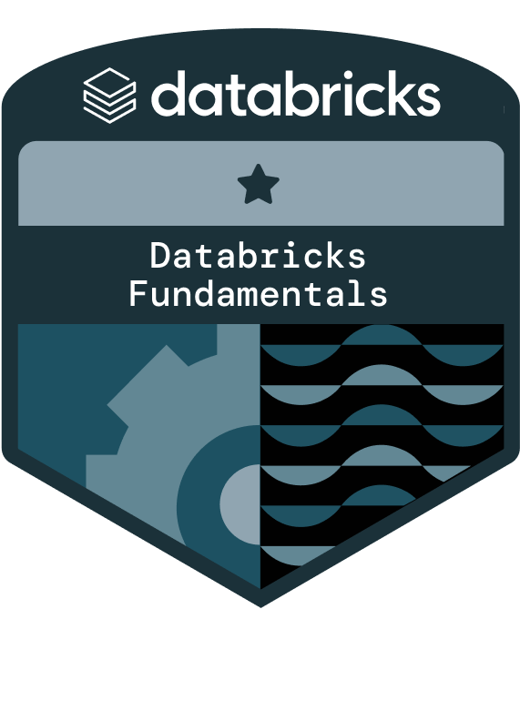
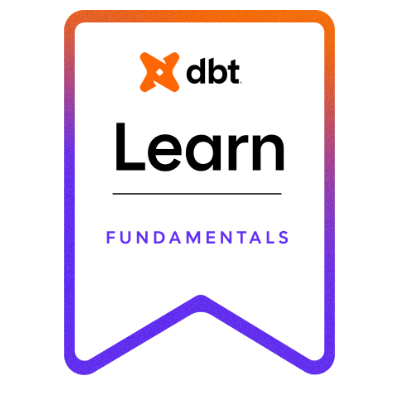

# Financial Market Data Pipeline

> ## Business Problem
>
> Institutional investors and quantitative analysts need reliable historical
> market data to support backtesting, factor modeling, and portfolio analytics.
> This pipeline ingests market data from heterogeneous sources, validates data
> quality, models historical dimensions, and publishes analytics-ready datasets
> — emphasizing reliability, reproducibility, and maintainability over raw
> feature count.

## Status

🚧 In active development. See build plan for phase-by-phase progress.

## Architecture

_(diagram + description coming in Phase 11)_

## Tech Stack

| Tool                             | Purpose                                |
| -------------------------------- | -------------------------------------- |
| Databricks (PySpark, Delta Lake) | Bronze/Silver/Gold medallion ingestion |
| dbt-core                         | Staging + Gold marts, tests, docs      |
| DuckDB                           | Local dev-loop validation              |
| Great Expectations               | Data quality checks                    |
| Airflow                          | Orchestration (retries, logging)       |
| Terraform                        | IaC — storage + IAM                    |
| GitHub Actions                   | CI/CD — dbt tests, SQL lint            |

**Certificates:**

## Progress Tracker

- [x] Phase 0 — Setup & scaffold
- [x] Phase 1 — Databricks & dbt Fundamentals Certificates
- [x] Phase 2 — Bronze ingestion & data contracts
- [ ] Phase 3A — Silver: cleaning
- [ ] Phase 3B — Silver: historical dimensions & corrections
- [ ] Phase 4 — DuckDB local validation
- [ ] Phase 5 — dbt + Gold layer
- [ ] Phase 6 — Great Expectations
- [ ] Phase 7 — Terraform
- [ ] Phase 8 — Airflow orchestration
- [ ] Phase 9 — CI/CD
- [ ] Phase 10 — Performance & scaling documentation
- [ ] Phase 11 — Documentation & README
- [ ] Phase 12 — Polish & publish
