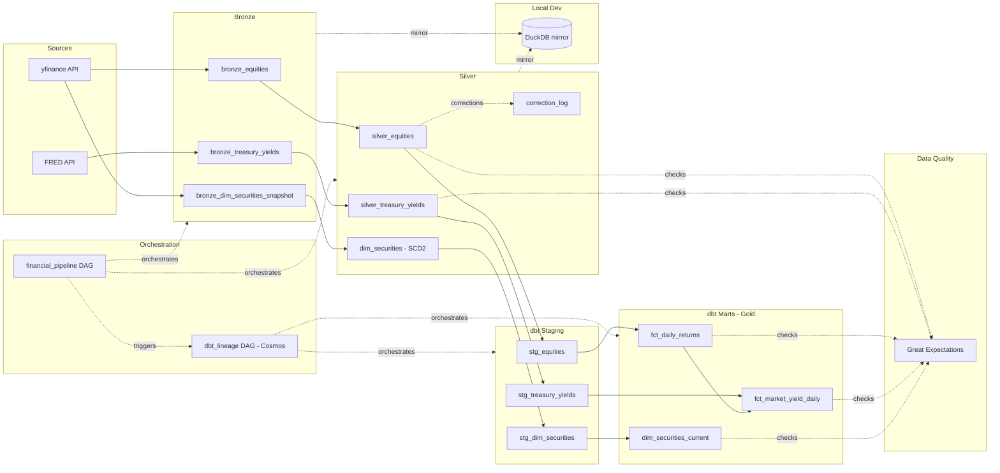

# Architecture

## Sources

Two independent, unrelated data sources: yfinance (equities pricing and
security reference data) and FRED (Treasury yield series). Neither
depends on the other's availability or schedule.

## Bronze

Raw ingestion, one table per source-and-purpose: `bronze_equities`,
`bronze_dim_securities_snapshot` (security reference data, also from
yfinance but pulled and staged separately from pricing), and
`bronze_treasury_yields`. Every record is schema-validated against
`config/schemas/` on ingest — malformed records are flagged, not silently
dropped. All three tables use a full-replace load strategy.

## Silver

Cleaned and conformed: `silver_equities` and `silver_treasury_yields`
mirror their Bronze counterparts' full-replace pattern, standardized and
deduplicated. `dim_securities` is the one deliberate exception — a Type 2
slowly changing dimension, append/MERGE loaded to preserve
reference-attribute history rather than replace it. `correction_log`
records every field-level correction applied to `silver_equities` via
windowed MERGE, giving a queryable audit trail of what changed and when.

## Local Dev

Bronze, Silver, dimension, and audit tables are mirrored into a local
DuckDB file on demand, same schema and grain as the Delta source, for
dev-loop iteration without serverless compute cost on every ad hoc query.
Read-only — nothing writes back to Delta from this layer.

## dbt Staging and Marts (Gold)

Silver tables are staged 1:1 (`stg_equities`, `stg_treasury_yields`,
`stg_dim_securities`) before reaching the Gold marts. The two source
lineages — equities/dimension data from yfinance, yield data from FRED —
run fully independently through every layer up to this point and meet
for the first time here: `fct_market_yield_daily` is a LEFT JOIN of
`fct_daily_returns` against staged treasury yields, the one place the two
lineages actually combine. `dim_securities_current` is staged separately
and stays independent of both fact tables.

## Data Quality

Great Expectations validates five consumer-facing tables —
`silver_equities`, `silver_treasury_yields`, and all three Gold marts —
scoped to freshness and range/set checks that complement, rather than
duplicate, the uniqueness/not-null/referential-integrity coverage already
provided by dbt tests.

## Orchestration

Two Airflow DAGs. `financial_pipeline` runs two branches in parallel — a
market-data branch (Bronze extract → Silver transform → corrections) and
a reference-data branch (reference snapshot → SCD2 versioning) — fanning
in to a single `trigger_dbt` task once both complete. That task hands off
to `dbt_lineage`, a Cosmos-generated DAG that runs one Airflow task per
dbt model (Staging and Marts both), each in an isolated Docker container.

---

Full rationale for every load-strategy, tooling, and infrastructure
choice reflected in this diagram is in `docs/data_modeling_decisions.md`.
Table-level grain, keys, and column definitions are in
`docs/data_dictionary.md`. Benchmark methodology behind the storage-layer
choices is in `docs/performance_and_scaling.md`.
