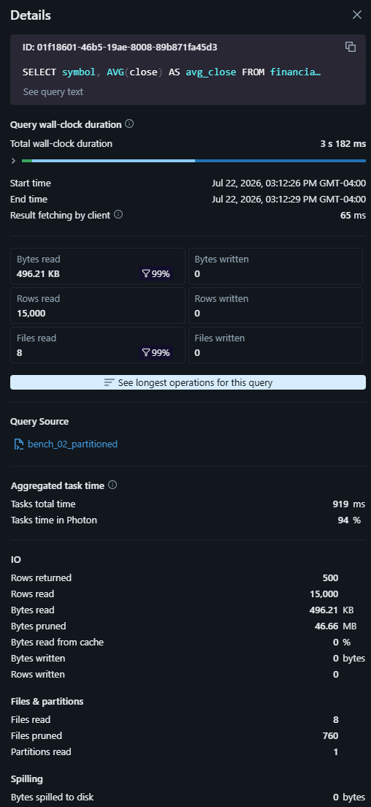
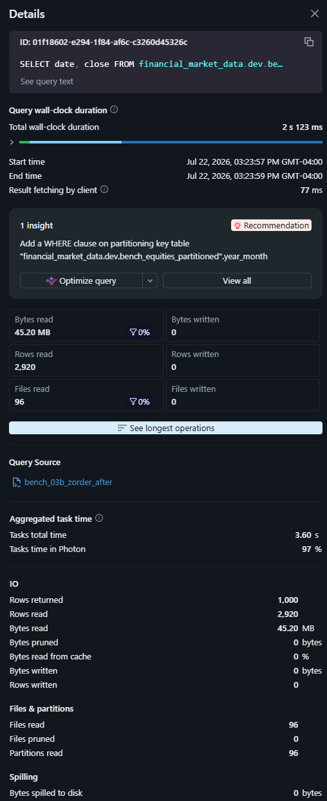
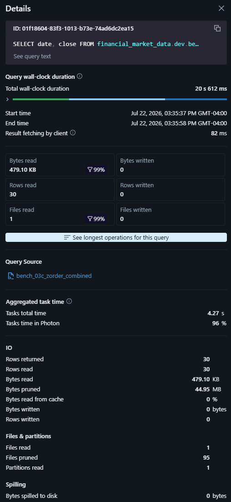
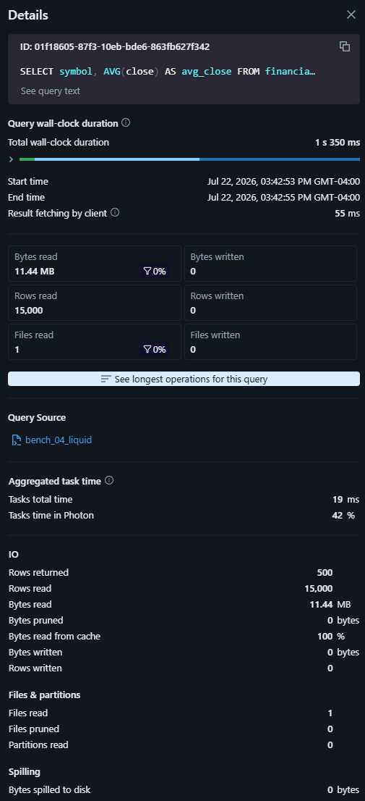
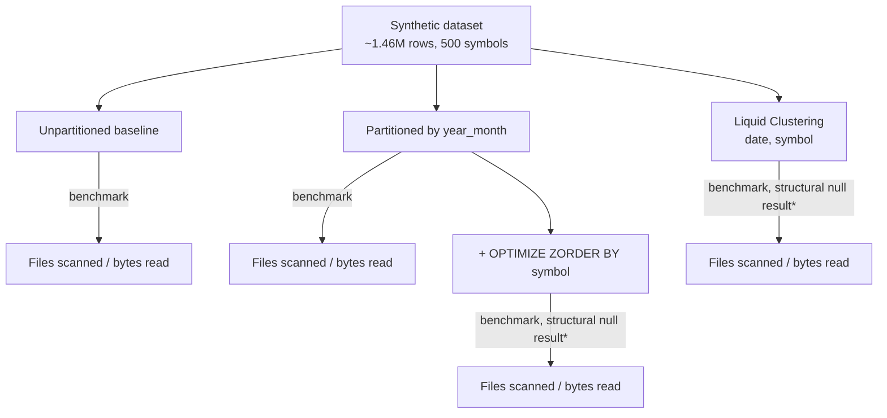

# Performance & Scaling: Delta Lake Storage Optimization

**Objective:** Demonstrate engineering decision-making around Delta Lake storage
optimization rather than maximize benchmark performance on a small development
dataset. This benchmark was designed to evaluate whether each optimization
mechanism had the opportunity to improve storage access patterns — not to
maximize benchmark gains.

## Why a synthetic dataset

The project's real `bronze_equities`/`silver_equities` tables are dev-scale —
`DESCRIBE DETAIL` confirms both materialize as a single Delta file
(`numFiles: 1`). At that scale, partitioning or clustering would add metadata
overhead without any corresponding scan-performance benefit, since there is
nothing to prune between. Rather than force a misleading benchmark onto data
too small to need optimization, a synthetic dataset was generated specifically
to demonstrate these patterns at a scale where they have measurable effect:
~1.46M rows (2,920 days × 500 symbols, ~8 years of daily equities data).

## Methodology

- Auto-optimization (`delta.autoOptimize.optimizeWrite`,
  `delta.autoOptimize.autoCompact`) was explicitly disabled on all benchmark
  tables, combined with a `REPARTITION(50)` hint on the baseline write. This
  was necessary in practice — an initial attempt without these safeguards,
  using only an `ORDER BY RAND()` shuffle, still resulted in Databricks
  auto-compacting the output to a single file.
- Four techniques benchmarked against identical underlying data: unpartitioned
  baseline, partitioned by `year_month`, partitioned + `OPTIMIZE ZORDER BY
(symbol)`, and Liquid Clustering (`CLUSTER BY date, symbol`).
- Two repeatable query shapes used for apples-to-apples comparison: a
  date-range filter (tests partition pruning) and a single-symbol filter
  (tests within-partition data skipping, since it doesn't touch the partition
  key). One combined filter query was also run to confirm partition pruning
  remains intact after compaction.
- **Files read and bytes read are treated as the primary evidence**, not
  wall-clock duration. Databricks Free Edition's serverless compute does not
  support `CLEAR CACHE` or other manual cache-control commands (confirmed via
  Databricks documentation — issuing them throws an exception on serverless).
  Duration figures below therefore reflect uncontrolled caching and serverless
  cold-start effects between runs and are noted as directional only; the
  storage-layer I/O metrics are deterministic and environment-independent.

## Partitioning rationale

`date` is the natural partitioning key for time-series market data — most
realistic analytical queries filter on a date range. Daily partitioning was
considered and rejected: at this dataset's scale, daily partitions would
average ~500 rows each (2,920 partitions total), a small-files anti-pattern
that increases metadata overhead without improving scan performance. Monthly
partitioning (`year_month`) was chosen instead, yielding ~96 partitions
averaging ~15,000 rows each — a more production-realistic granularity.

## Benchmark Results (Relative Performance)

_Numbers below are specific to this benchmark's environment and data volume;
treat percentage reductions, not absolute byte/time figures, as the
transferable finding._

| Technique                  | Query Type               | Files Read | Files Pruned | Partitions Read | Bytes Read | Notes                                    |
| -------------------------- | ------------------------ | ---------- | ------------ | --------------- | ---------- | ---------------------------------------- |
| Unpartitioned baseline     | Date range               | 50 / 50    | 0            | 0               | 23.40 MB   | No pruning possible                      |
| Partitioned (`year_month`) | Date range               | 8 / 768    | 760          | 1               | 496.21 KB  | **97.9% reduction** vs. baseline         |
| Partitioned + ZORDER       | Date + symbol (combined) | 1 / 96     | 95           | 1               | 479.10 KB  | Partition pruning intact post-compaction |
| Partitioned + ZORDER       | Symbol only              | 96 / 96    | 0            | 96              | 45.20 MB   | See "Architectural Analysis" below       |
| Liquid Clustering          | Date range               | 1 / 1      | 0            | 0               | 11.44 MB   | See "Architectural Analysis" below       |
| Liquid Clustering          | Symbol only              | 1 / 1      | 0            | 0               | 11.44 MB   | Structural ceiling — see below           |

<p>

</p>

<p>

</p>

### Observations

- **Partition pruning delivered the headline result**: filtering on the
  partition key reduced bytes read by 97.9% (23.40 MB → 496 KB), and the
  combined date+symbol filter reduced it further to 479 KB — a ~99% reduction
  from the unpartitioned baseline.
- Partition elimination remained fully functional after `OPTIMIZE` compacted
  each partition to a single file — the combined-filter query still correctly
  read only 1 of 96 partitions.
- ZORDER and Liquid Clustering did not show additional file-skipping benefit
  in this benchmark. This was investigated directly rather than left
  unexplained — see below.

## Architectural Analysis: Structural Null Results Under Low Data Volume

A **structural null result** is one where an optimization was correctly
configured and executed, but the benchmark's conditions prevented its
underlying mechanism from having any effect — distinct from a failed or
misconfigured optimization.

**Expected:**

```
Many files per partition → OPTIMIZE ZORDER → file skipping → lower bytes read
```

**Observed:**

```
1 file per partition → OPTIMIZE ZORDER → nothing left to skip → no measurable effect
```

### ZORDER

Before `OPTIMIZE`, the partitioned table held 768 files across 96 partitions
(~8 files/partition). A symbol-filtered query against this state read 672
files across all 96 partitions — no benefit from partitioning (the filter
doesn't touch `year_month`) and no data-skipping yet, since ZORDER hadn't run.

<p>

</p>

Running `OPTIMIZE ... ZORDER BY (symbol)` compacted those 768 files down to
exactly 96 — one file per partition (confirmed via the operation's own
metrics: `numFilesAdded: 96`, `numFilesRemoved: 768`). At one file per
partition, "read the partition" and "read the file" become the same
operation: there is no remaining file-level granularity for ZORDER's
data-skipping to act on. The subsequent symbol-filtered query read all 96
files, with `Files pruned: 0` — not because ZORDER failed, but because
compaction had already eliminated the precondition (multiple files per
partition) that data skipping requires.

<p>

</p>

The apparent 86% file-count drop between the "before" and "after" ZORDER runs
(672 → 96) is therefore attributable to **file compaction**, not ZORDER's
characteristic clustering behavior, and is documented in the narrative here
rather than presented as a benchmark table row, to avoid misattributing the
cause.

A combined filter (`year_month = '2022-06' AND symbol = 'SYM0042'`) run
against the same post-compaction table confirms partition pruning remains
fully intact: 1 file read, 95 pruned, 1 of 96 partitions touched.

<p>

</p>

### Liquid Clustering

The Liquid Clustering table (`CLUSTER BY date, symbol`) materialized as a
**single file for the entire table** immediately on write — before `OPTIMIZE`
was even run. Running `OPTIMIZE` afterward changed nothing: its own metrics
confirm zero work was performed (`numFilesAdded: 0`, `numFilesRemoved: 0`,
`numLeafNodesClustered: 0`), because the file was already above Delta's
minimum compaction threshold and there was nothing to reorganize.

Both queries against this table read the same single 11.44 MB file regardless
of filter — a lower bytes-read figure than the raw unpartitioned baseline
(11.44 MB vs. 23.40 MB, likely due to column-level statistics still assisting
row-group skipping within the file), but well above the partitioned table's
result, since no partition- or file-level elimination is structurally
possible with one file.

<p>

</p>

Liquid Clustering is designed to provide its greatest benefit on large,
continuously evolving datasets with repeated incremental writes and changing
query patterns — it reduces the need to hand-select a partition key and
adapts as query patterns shift, without requiring a full table rewrite the
way changing a partition scheme does. This benchmark's single bulk load
doesn't exercise those strengths, independent of the file-count ceiling
observed above.

### Why not scale the dataset to force a cleaner result?

Delta's compaction thresholds observed during this benchmark (`minFileSize:
16 MB`, `maxFileSize: 64 MB`) mean that reliably producing multiple files per
partition at this row distribution would require roughly 60–120x the current
data volume — a materially larger compute commitment on a single Free Edition
2X-Small serverless warehouse, not an incremental adjustment. More
importantly, scaling the dataset until ZORDER or Liquid Clustering happened
to "win" would have substituted a manufactured result for the actual finding:
that both techniques were correctly implemented and structurally inert at
this data volume, for a well-understood reason. The null result, backed
directly by Delta's own `OPTIMIZE` metrics, is treated here as the real
finding, not a shortfall to be engineered away.

## Compute Configuration Comparison: Scoped Down

The project's roadmap also called for running a representative job
against 2–3 different serverless compute configurations and documenting
actual cost/latency tradeoffs. This was investigated and found not to be
executable in the current environment, rather than skipped without review.

Databricks Free Edition provisions exactly one SQL warehouse, hard-locked to
a 2X-Small cluster size — confirmed via Databricks' own documentation, not
assumed. Free Edition explicitly does not support custom compute
configurations, meaning there is no warehouse-size lever to vary, no ability
to provision a second warehouse at a different size for comparison, and no
exposed control for Photon toggling or autoscaling min/max cluster counts.

This mirrors the same class of finding documented above for ZORDER and
Liquid Clustering: the technique/comparison is well-understood and would be
straightforward to execute given the right environment, but this
environment's provisioning surface does not expose the axis needed to
demonstrate it. Rather than substitute a workaround that wouldn't reflect a
genuine compute-tier comparison, this is documented as a scoped-down,
environment-constrained finding — consistent with the same Free-Edition
provisioning-surface constraint noted in Phase 7's Terraform resource choice.

If evaluated on a paid Databricks tier (Pro or Classic warehouses, or a
Premium-plan workspace), the same benchmark queries used above would be
re-run across, for example, a 2X-Small vs. Medium vs. Large warehouse, with
query duration and estimated DBU cost captured per tier — the natural
extension of this document once compute-tier variability is actually
available.

## Why the real project's Bronze/Silver tables remain unpartitioned

The production pipeline's Bronze and Silver layers intentionally do not
partition or cluster their tables. At current development-scale data volume
(`numFiles: 1` on both `bronze_equities` and `silver_equities`), partitioning
would introduce metadata overhead and query-planning complexity without any
corresponding scan-performance benefit — the same structural ceiling
demonstrated above with the synthetic Liquid Clustering table. This benchmark
exists to document the patterns that would apply once real data volume
crosses that threshold, not to retrofit optimization onto data that doesn't
yet need it.

## Scaling Roadmap

| Dataset Size  | Recommended Strategy                                                        | Rationale                                                                                                                   |
| ------------- | --------------------------------------------------------------------------- | --------------------------------------------------------------------------------------------------------------------------- |
| < 5 GB        | No partitioning                                                             | Partitioning adds metadata overhead without scan benefit                                                                    |
| 5–100 GB      | Monthly partitioning                                                        | Reduces scan scope for time-range queries; partition count stays manageable                                                 |
| 100 GB – 1 TB | Evaluate partitioning strategy; combine with OPTIMIZE/ZORDER as appropriate | The "correct" strategy is workload-dependent; data skipping becomes worthwhile once partitions/clusters span multiple files |
| > 1 TB        | Liquid Clustering                                                           | Avoids static partition-key lock-in; adapts to evolving query patterns without full rewrites                                |

ZORDER and Liquid Clustering's benefits activate specifically once a
partition (or cluster region) spans multiple files post-compaction — itself
a function of data volume relative to Delta's target file size. This
benchmark's ~50 MB total volume sits below that threshold across the board,
consistent with the "< 5 GB" row above.

## Benchmark Flow



\*See Architectural Analysis above.

## Limitations

- Synthetic data lacks real-world skew (symbol trading volume, seasonality)
  that could affect optimization behavior differently in production.
- All benchmarks ran on the same Free Edition serverless warehouse
  configuration (single 2X-Small warehouse); results are not necessarily
  representative of larger compute tiers.
- Manual cache control (`CLEAR CACHE`) is unsupported on Free Edition
  serverless compute; wall-clock duration figures may reflect cache state or
  serverless cold-starts rather than pure query execution cost. Storage-layer
  metrics (files/bytes read) are unaffected by caching and are treated as the
  primary evidence throughout.
- Total synthetic dataset volume (~50 MB) is sufficient to demonstrate
  partition pruning but below the threshold at which ZORDER and Liquid
  Clustering's within-file data-skipping mechanisms have files to act on —
  documented directly above rather than worked around.
- Cluster/warehouse startup time is not isolated from query execution time
  in the duration figures reported.
- No compute-configuration (warehouse size, Photon, autoscaling) comparison
  is included — Free Edition exposes no variable compute levers to compare.
  See "Compute Configuration Comparison: Scoped Down" above.

---

_Generated as part of Portfolio Project 2, Phase 10 · Michael Hoover ·
github.com/hoover180/financial-market-data-pipeline_
